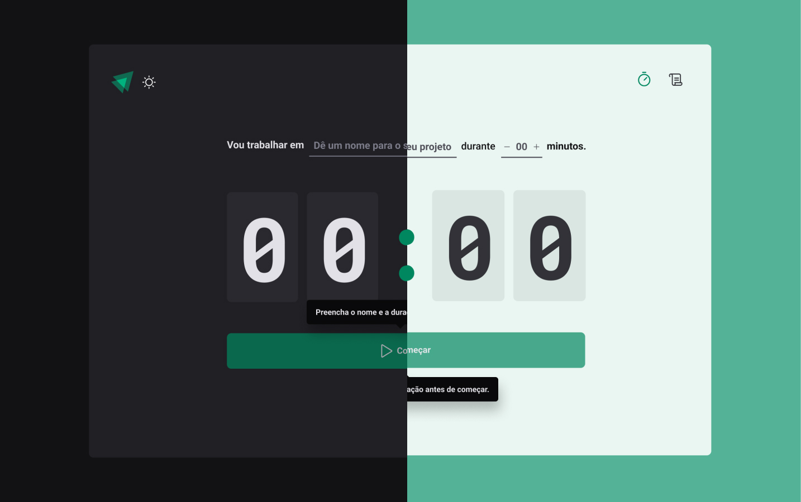

# Ignite Timer

Segundo projeto da trilha ReactJS Ignite da [Rocketseat](https://www.rocketseat.com.br/). O Ignite Timer e um projeto de um contador focado em melhorar a sua produtividade, permitindo que acompanhe o tempo de suas tarefas / projetos através de ciclos.

O projeto inicialmente feito com algumas certas tecnologias, porém está e uma versão adaptada com algumas tecnologias / bibliotecas mais atuais.

## Tecnologias Utilizadas
- React
- Typescript
- TailwindCSS
- Lucide Icons
- React Hook Form
- React Router
- Zod
- Shadcn/UI

## Ferramentas e métodos Utilizadas
- VS Code
- Figma
- Commit atômico / por funcionalidade
- Pattern de commit da Conventional Commits (Commits semânticos)

## Funcionalidades
- Contador
- Histórico
- Roteamento da página
- Responsividade
- Tema Dark / Light

## Instalação

Siga estas etapas para configurar o Ignite Timer localmente:

1. Clone o repositório: `git clone https://github.com/LFeli/Ignite-Timer.git .`
2. Instale as dependências: `npm install`
3. Inicie o aplicativo: `npm run dev`

## Como Usar

1. Ao acessar a aplicação, você verá a tela do contador.
2. Crie uma nova tarefa, especificando o projeto e a duração desejada (entre 5 e 60 minutos).
3. Inicie o ciclo e concentre-se na tarefa.
4. Ao término do ciclo, a tarefa será marcada como concluída.
5. Visualize o histórico para revisar tarefas passadas.

## Personalização

Escolha entre o tema Dark ou Light Clicando no ícone de lua e alterando entre tema Dark ou Light.

## Demonstração

Abaixo uma previa de como é o projeto:

